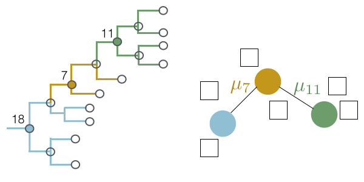

# Quantifying antigenic evolution in influenza using a clustered cartographic model

* [Manuscript](manuscript/)
* [Antigenic clustering example xml and files](example/)
* [scripts used for analysis](dev/)
* [data used for analysis](dev/)
* [Antigenic clustering source code in BEAST](https://github.com/beast-dev/beast-mcmc/tree/antigenic-clustering)

